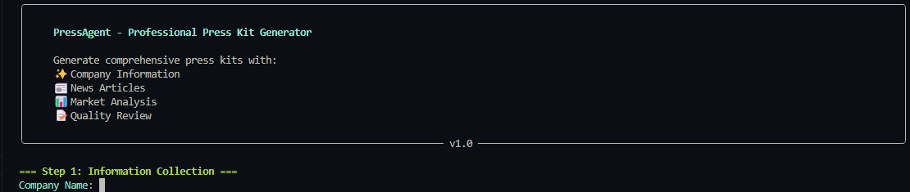

# PressAgent: Press Kit Automatic Generation and Quality Review System


**PressAgent** is a comprehensive system designed to automate the creation and quality review of professional press kits using AI technology, news aggregation, and advanced content analysis. This project demonstrates the effective use of AI for real-world applications, emphasizing problem-solving, creativity, and end-to-end pipeline implementation.

---

## **Project Overview**
PressAgent simplifies the process of creating press kits by:
- Automatically generating press releases, company overviews, PR messages, and email drafts.
- Collecting and integrating relevant news articles using APIs.
- Providing detailed quality analysis of the generated content, including readability scoring, style evaluation, and SEO optimization suggestions.

---

## **Core Components**
The project is divided into the following modules:

### 1. **Data Collection (`data_collector.py`)**
- **Company Information Collection**:
  - Collects basic company details (name, industry, products/services, achievements, brand attributes).
  - Gathers press release specifics (topic, target audience, tone, key message, call to action).
- **News Integration**:
  - Uses **NewsAPI** to fetch relevant news articles.
  - Allows users to verify and select articles for inclusion in the press kit.
  - Structures collected data for further processing.

### 2. **Content Generation (`content_generator.py`)**
- **AI Integration**:
  - Initially used OpenAI's GPT-3.5, now switched to **Hugging Face's Mistral model**.
  - Implements structured prompt engineering for high-quality content generation.
  - Includes robust error handling and input validation.
- **Generated Components**:
  - Press Release
  - Company Overview
  - PR Message
  - Email Draft

### 3. **Quality Review (`quality_reviewer.py`)**
- **Content Analysis**:
  - Uses **textstat** for readability scoring.
  - Evaluates content consistency, writing style, and SEO optimization.
- **Review Metrics**:
  - Provides an overall quality score.
  - Offers detailed criterion scores and specific recommendations for improvement.

### 4. **Main Application (`main.py`)**
- **Process Orchestration**:
  - Manages the step-by-step workflow.
  - Handles user interaction and error management.
  - Validates data at each stage.
- **Output Generation**:
  - Exports press kits in JSON and text formats.
  - Generates structured documentation for easy use.

### 5. **Web Interface (`app.py`)**
- **Streamlit Integration**:
  - Provides a user-friendly web interface.
  - Includes interactive components for real-time preview.
  - Offers multiple export options for generated content.

---

## **API Configuration**

To use PressAgent, you need to provide your own API keys for **Hugging Face** and **NewsAPI**. Follow these steps:

1. Create a `.env` file in the root directory of the project.
2. Add the following lines to the `.env` file, replacing `your_huggingface_key` and `your_newsapi_key` with your actual API keys:

   ```plaintext
   HUGGINGFACE_API_KEY=your_huggingface_key
   NEWS_API_KEY=your_newsapi_key


## **Implementation Details**

### **Environment Setup**
Install the required dependencies:
```bash
pip install -r requirements.txt
```
### Run the main application:

```bash
python main.py
```

### For CLI interface:
```bash 
python cli.py
```
- It would look like this :


### Web Interface
#### Run the Streamlit app:

```bash
streamlit run app.py
```

